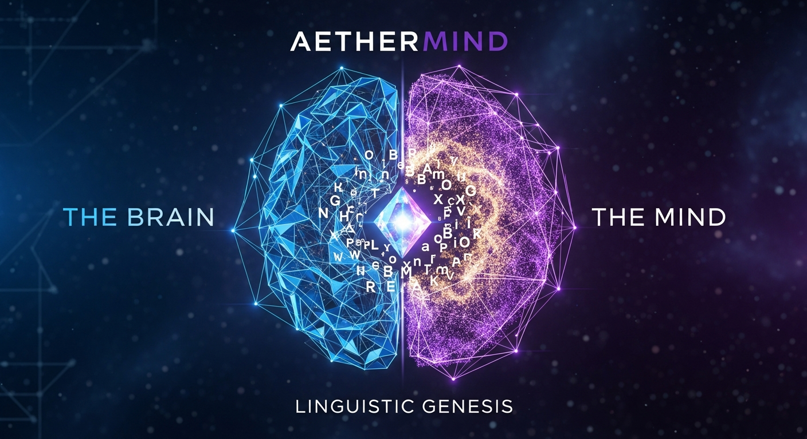

# AetherMind - The Digital Organism

<div align="center">
  
</div>

**Version:** 1.0.0 (Phase 1: Linguistic Genesis)  
**Developer:** AetherGI  
**Architecture:** Developmental Continual Learning Architecture (DCLA)

---

## 1. Project Vision
AetherMind is not a static Large Language Model (LLM). It is a **Digital Organism** designed to grow, learn, and adapt in real-time. Unlike traditional AIs that are "frozen" after training, AetherMind uses a "Split-Brain" architecture to separate **Reasoning (The Brain)** from **Knowledge (The Mind)** and **Interaction (The Body)**.

This project aims to bridge the gap between statistical word-guessing and True Artificial General Intelligence (AGI) by allowing an agent to "grow up" from a baby (core logic) to an expert (specialized knowledge) across multiple physical and digital environments.

---

## 2. The Architecture: Brain, Mind, and Body

### A. The Brain (Cognitive Core)
The "fixed" part of the system. It contains:
*   **Logic & Physics Priors:** Understanding how the world works (cause and effect).
*   **Active Inference Loop:** The drive to minimize "surprise" by learning from mistakes.
*   **Safety Inhibitor:** A hard-coded ethical "conscience" that blocks harmful actions.

### B. The Mind (Knowledge Repository)
The "expandable" part of the system. It uses:
*   **Vector Memory:** Infinite storage for facts, textbooks (K-12), and user interactions.
*   **Episodic Memory:** A "digital journal" that allows AetherMind to remember a conversation from years ago.
*   **Knowledge Cartridges:** Swappable modules that instantly make the AI an expert in coding, medicine, or mechanics.

### C. The Body (Interface Layer)
In AetherMind, the **Body** is an "Enclosure" that allows the Brain to interact with the world. One Brain can inhabit many Bodies:
*   **The Chat Body:** (Phase 1 Focus) Text-based interaction via web/mobile.
*   **The Coding Body (AetherCode):** An IDE-integrated body that can read/write and execute code.
*   **The Ambient Body:** Smart homes and IoT devices.
*   **The Kinetic Body:** Smart cars and drones.
*   **The Physical Shell:** (Future Goal) Humanoid robotics.

---

## 3. Evolutionary Roadmap (The 4 Phases)

### Phase 1: Linguistic Genesis (Current)
*   **Objective:** Master logic, text, and conversation.
*   **Focus:** Grounding words in logic rather than probability.
*   **Key Tech:** FireCrawl for K-12 ingestion, Pinecone for episodic memory.
*   **Outcome:** A chat agent that remembers everything and reasons with "common sense."

### Phase 2: Sensory Awakening (Visuals)
*   **Objective:** Learn to "see" and "watch."
*   **Focus:** Integrating JEPA (Joint Embedding Predictive Architecture) for image and video processing.
*   **Outcome:** The agent can watch a "How-To" video and learn a new skill (like fixing a sink) by updating its Mind.

### Phase 3: Phonetic Articulation (The Voice)
*   **Objective:** Learn to speak, not just "generate audio."
*   **Focus:** Instead of using standard Text-to-Speech (TTS), AetherMind will **learn to sound out words** phonetically.
*   **Mechanism:** It will simulate a vocal tract and learn how air and vibration create sounds (phonemes), allowing it to develop a unique, non-robotic "personality" in its voice.

### Phase 4: Physical Embodiment (Humanoid Robotics)
*   **Objective:** Full real-world interaction.
*   **Focus:** Migrating the Brain into a **Humanoid Robot Body**.
*   **Key Tech:** Motor Cortex simulation, tactile sensors, and real-time spatial navigation.
*   **Outcome:** AetherMind moves from a screen to the physical world, capable of performing manual tasks, navigating homes, and assisting humans physically.

---

## 4. Why AetherMind is Different

| Feature | Traditional LLM | AetherMind (DCLA) |
| :--- | :--- | :--- |
| **Learning** | Frozen after training | Continuous (learns every second) |
| **Memory** | Small "Context Window" | Infinite Episodic Memory |
| **Understanding** | Statistical Probability | Causal World Model |
| **Safety** | Filter-based (Jailbreakable) | Hard-wired Inhibitor (Absolute) |
| **Knowledge** | Baked into weights | Externalized and Updateable |

---

## 5. Technical Setup (Phase 1)

### Prerequisites
* Python 3.10+
* API Keys for: FireCrawl (Ingestion), Pinecone (Memory), and your preferred GPU provider.

### Quick Start
1. **Initialize the Structure:**
   Run the provided `setup_aethermind.py` script to generate the directory tree.
2. **Ingest the Curriculum:**
   ```bash
   python mind/ingestion/k12_ingestor.py --source "verified_educational_url"
   ```
3. **Launch the Orchestrator:**
   ```bash
   uvicorn orchestrator.main_api:app --reload
   ```
4. **Connect a Body:**
   Open the `interface/web_dashboard` to begin the first conversation with the "Baby" agent.

---

## 6. Future Expansion: The Humanoid Goal
The ultimate "Body" for AetherMind is a humanoid form. The architecture is built so that the **Brain** you talk to today in Phase 1 is the *exact same* Brain that will eventually control a robotic hand or walk through a door in Phase 4. By learning logic and language first, the robot will already have "common sense" before it ever takes its first step.

---

## 7. Contribution & Ethics
AetherMind is developed under the **Prime Directive**: *AI must be a beneficial extension of human intent.* 

**AetherGI - Building Intelligence that Grows With You.**
